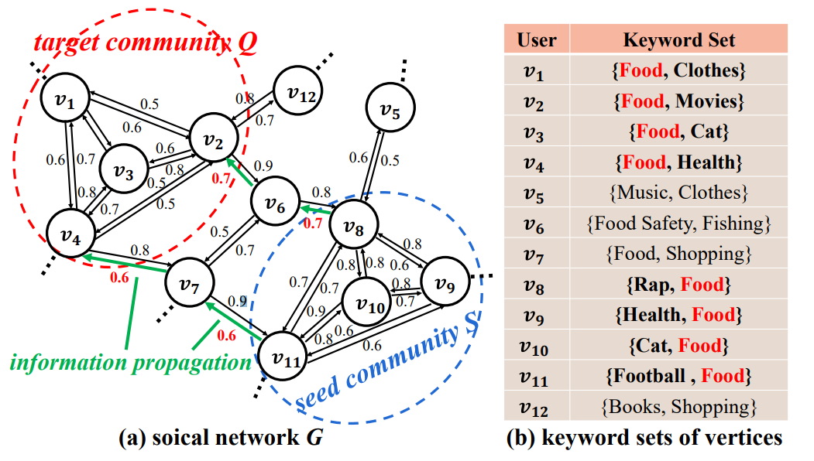

# RICS

##### Reverse Influential Community Search Over Social Networks



# Requirement

- ##### Python == 3.8

- ##### networkx

# Usage

```
python train.py
```

# Dataset

##### Our dataset comes from https://snap.stanford.edu/data/#socnets. 